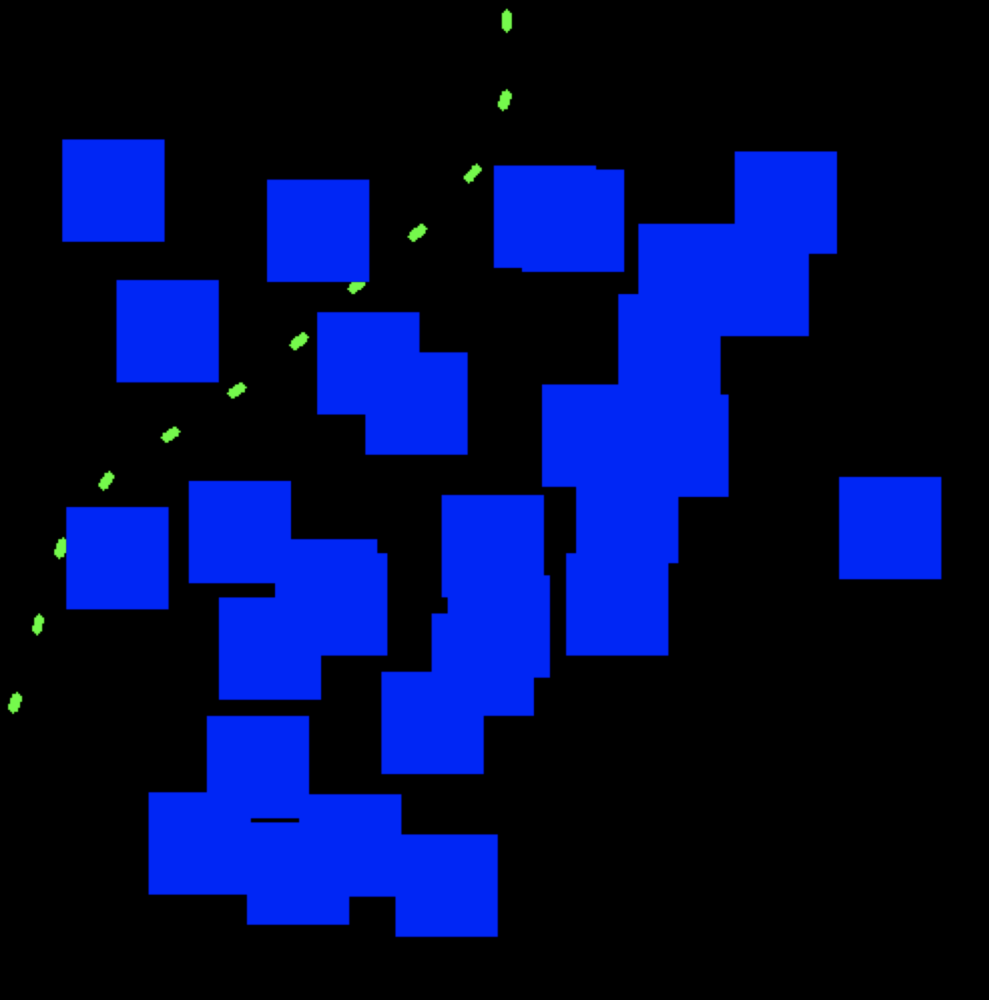
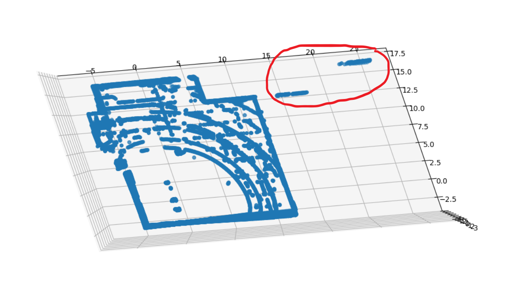
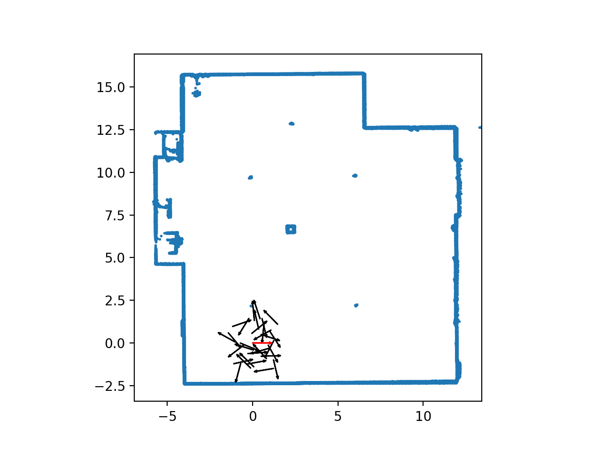

# CS 598 Methods for Building Autonomous Vehicles

## Self Driving: Path Planning with Monte Carlo Tree Search on Lidar Data
This project allows the GEM to autonomously avoid both static and dynamic obstacles by planning and executing optimal driving path trajectories in real time. Later on, you can see Professor Forsyth blocking off the initial planned path so the vehicle replans and drives out of the highbay.

## Monte Carlo Tree Search Algorithm

## Occupancy grid generation from lidar point cloud

## Final Demo

